# Laporan Proyek Machine Learning

### Nama : Satrya wirangga permana putra

### Nim : 211351138

### Kelas : Pagi B

## Domain Proyek
Grocery Store atau toko kelontong adalah toko ritel jasa makanan yang terutama menjual berbagai macam produk makanan, yang mungkin segar atau dikemas. Namun, dalam penggunaan sehari-hari di AS, "toko kelontong" adalah sinonim untuk supermarket, dan tidak digunakan untuk merujuk pada jenis toko lain yang menjual bahan makanan. Di Inggris, toko-toko yang menjual makanan dibedakan menjadi grocers atau grocery shops (walaupun dalam penggunaan sehari-hari, orang biasanya menggunakan istilah "supermarket" atau "corner store"[4] atau "toko serba ada").

## Business Understanding

Dikarenakan pelanggan kadangkala mengalami kesulitan dalam menemukan barang yang ingin dibeli, kami bermaksud untuk memproyeksikan frekuensi pembelian suatu barang dengan mengetahui riwayat pembelian sebelumnya. Hal ini bertujuan agar kami dapat menempatkan barang kedua secara strategis, berdekatan dengan barang pertama, untuk meningkatkan kenyamanan dan kemudahan bagi pelanggan.

### Problem Statements

Menjelaskan pernyataan masalah latar belakang:

- Pembeli mengalami kesulitan dalam menemukan barang yang ingin dibeli.
- Toko tidak dapat memberikan bantuan yang memadai bagi pelanggan dalam pencarian barang.
- Untuk meningkatkan kenyamanan pelanggan, kami berkomitmen untuk mengoptimalkan pengalaman berbelanja dengan menyediakan petunjuk yang jelas dan memindahkan barang-barang terkait secara strategis, sehingga pembeli dapat dengan mudah menemukan dan memilih produk yang mereka butuhkan

### Goals Dengan Solution Statements

Menjelaskan tujuan dari pernyataan masalah:

-  Melakukan penelitian menggunakan algoritma Apriori untuk meramalkan produk selanjutnya yang kemungkinan akan dibeli oleh pelanggan.
-   Mendapatkan wawasan mengenai produk-produk yang sering dibeli secara bersamaan oleh pelanggan.

## Import Dataset
\[Groceries dataset for Market Basket Analysis(MBA)\]\[<https://www.kaggle.com/datasets/rashikrahmanpritom/groceries-dataset-for-market-basket-analysismba/data>)

Pertama-tama, saya mengunggah file kaggle.json untuk memperoleh akses ke platform Kaggle.

``` python
from google.colab import files
files.upload()
```
Berikutnya, saya membuat direktori dan mengatur izin pada skrip ini

``` python
!mkdir -p ~/.kaggle
!cp kaggle.json ~/.kaggle/
!chmod 600 ~/.kaggle/kaggle.json
!ls ~/.kaggle
```
Lalu mendownload dataset tersebut

``` python
!kaggle datasets download -d rashikrahmanpritom/groceries-dataset-for-market-basket-analysismba
```
lalu saya melakukan unziping data

```python
!mkdir groceries-dataset-for-market-basket-analysismba
!unzip groceries-dataset-for-market-basket-analysismba.zip -d groceries-dataset-for-market-basket-analysismba
!ls groceries-dataset-for-market-basket-analysismba
```
## Import Library

lalu saya import library yang akan digunakan

``` python
import numpy as np
import pandas as pd
from mlxtend.preprocessing import TransactionEncoder
from mlxtend.frequent_patterns import apriori, association_rules
import matplotlib.pyplot as plt
import seaborn as sns
import plotly.graph_objects as go
import plotly.express as px
import plotly.figure_factory as ff
```
## Data Discovery

kemudian saya melakukan pembacaan data 
``` python
df = pd.read_csv("groceries-dataset-for-market-basket-analysismba/Groceries data.csv")
bk = pd.read_csv("groceries-dataset-for-market-basket-analysismba/basket.csv")
df.head()
```
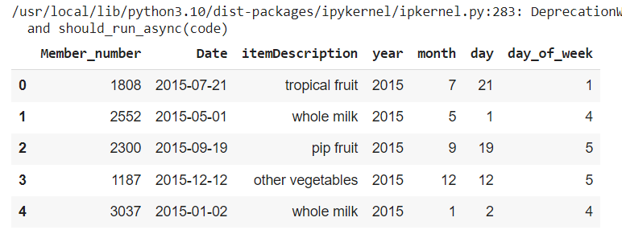

lalu saya mengecek info data 
``` python
groceries_df.info()
```
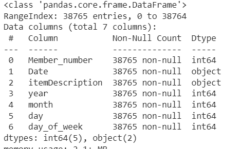

cek statistika data 
``` python
groceries_df.describe()
```
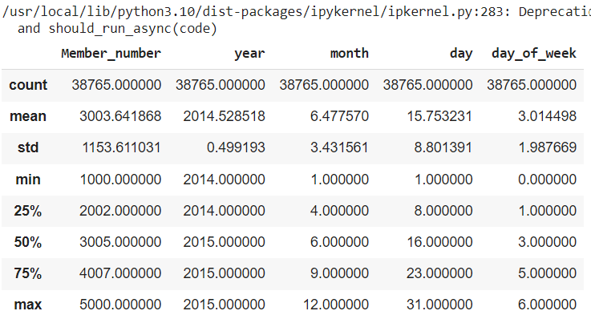

### Variabel-variabel pada Laptop Prices Dataset adalah sebagai berikut:

-   Member_number : Merupakan nomor identitas pelanggan \[Bertipe:Integer ,Contoh: 1187,4941\]
-   Date : Merupakan tahun , bulan dan hari \[Bertipe:Date , Contoh: 2015-12-12\]
-   ItemDescription : Merupakan bahan groceries \[Bertipe:String , Contoh: Whole milk, Bread\]
-   year : Merupakan tahun \[Bertipe:Integer , Contoh: 2015\]
-   month : Merupakan bulan \[Bertipe:Integer, Contoh: 12\]
-   day : Merupakan hari \[Bertipe:Integer ,Contoh: 5,4\]
-   day_of_week : Merupakan hari ke berapa di minggu itu\[Bertipe:Integer ,Contoh: 5,4\]

## EDA

manampilkan top 10 pembelian terhadap item 
``` python
groceries_df_cleaned = groceries_df.copy().drop_duplicates(keep='first')

groceries_df_cleaned['day_of_week'] = groceries_df_cleaned['day_of_week'].replace({0:'Monday', 1:'Tueday', 2:'Wednesday', 3:'Thursday', 4:'Friday', 5:'Saturday', 6:'Sunday'})

groceries_df_cleaned['itemDescription'].value_counts().head(10).plot(kind='bar', edgecolor='black')

plt.xlabel('Item types')
plt.ylabel('Purchase count')
plt.title('Top 10 most purchased item types')
```


menampilkan top 10 pembelian barang pada tahun 2014
``` python
groceries_df_cleaned[groceries_df_cleaned['year'] == 2014]['itemDescription'].value_counts().head(10).plot(kind='bar', edgecolor='black')

plt.xlabel('Item types')
plt.ylabel('Purchase count')
plt.title('Top 10 most purchased item types in year 2014')
plt.show()
```
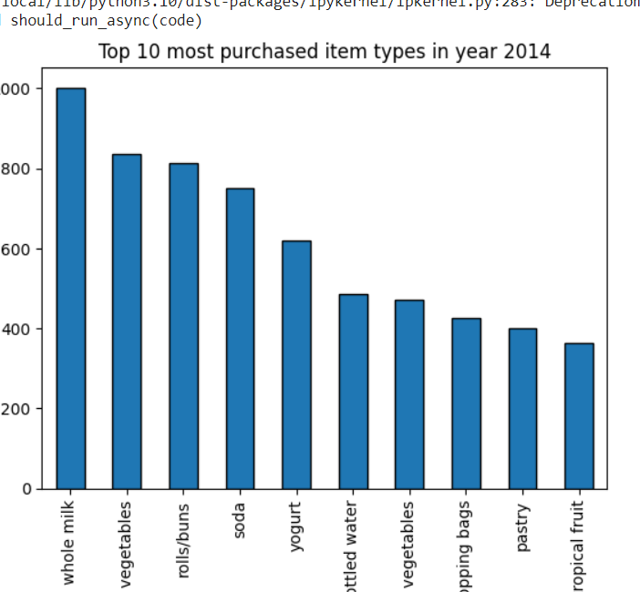

menampilkan top 10 pembelian barang pada tahun 2014
``` python
groceries_df_cleaned[groceries_df_cleaned['year'] == 2015]['itemDescription'].value_counts().head(10).plot(kind='bar', edgecolor='black')

plt.xlabel('Item types')
plt.ylabel('Purchase count')
plt.title('Top 10 most purchased item types in year 2015')
plt.show()
```
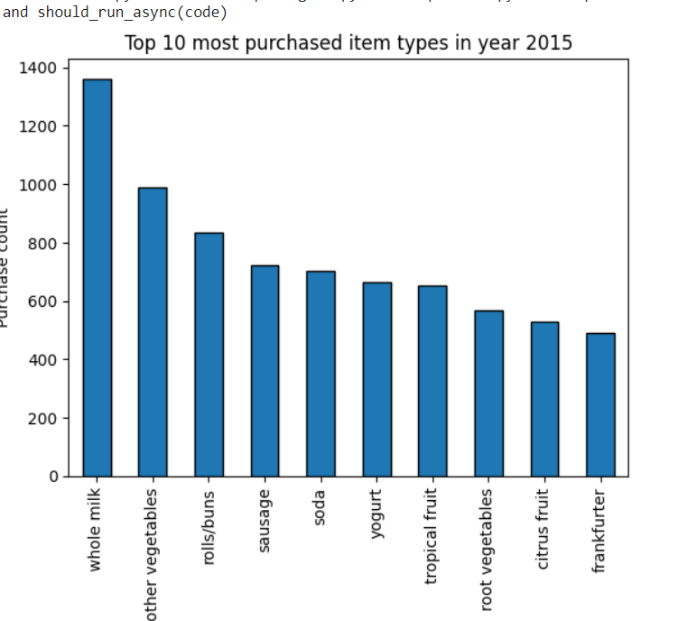

selanjutnya melihat apakah ada perbedaan pola pembelian pada hari yang berbeda dalam seminggu
``` python
groceries_df_cleaned['day_of_week'].value_counts().plot(kind='bar',edgecolor='black')
```
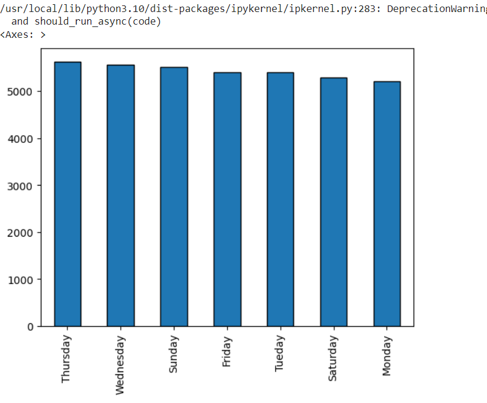

selanjutnya cek nomor pembelian pada tahun 2014 - 2015
``` python
print(groceries_df_cleaned['year'].value_counts())
groceries_df_cleaned['year'].value_counts().plot(kind='bar',edgecolor='black',color='green')
plt.title('Number of transactions: 2014 VS 2015')
```

## Data Preprocessing

sebelum masuk ke model , data perlu diproses kembali 
``` python
def zhangs_rule(rules):
    rule_support = rules['support'].copy()
    rule_ante = rules['antecedent support'].copy()
    rule_conseq = rules['consequent support'].copy()
    num = rule_support - (rule_ante * rule_conseq)
    denom = np.max((rule_support * (1 - rule_ante).values,
                          rule_ante * (rule_conseq - rule_support).values), axis = 0)
    return num / denom
```

melihat apakah ada nilai nan dan diubah kedalam string
``` python
# fill na as 'NA' to tranform every value into string
basket_df.fillna('NA',inplace=True)
bk_2d = basket_df.values.tolist()
bk_2d[0]
```
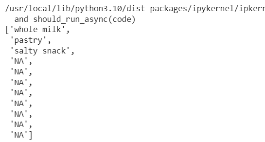

lanjutkan mengiterasi nilai selain nan
``` python
for i in range(len(bk_2d)):
    bk_2d[i] = [x for x in bk_2d[i] if not x=='NA']
bk_2d[0:5]
```
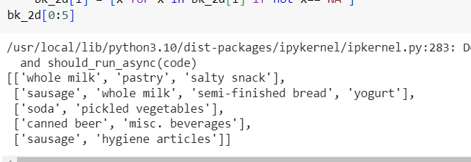

selanjutnya ubah kedalam bentuk object 
``` python
TE = TransactionEncoder()
TE.fit(bk_2d)
item_matrix = TE.transform(bk_2d)
bk_item = pd.DataFrame(item_matrix, columns = TE.columns_)
print(bk_item.shape)
bk_item.head()
```
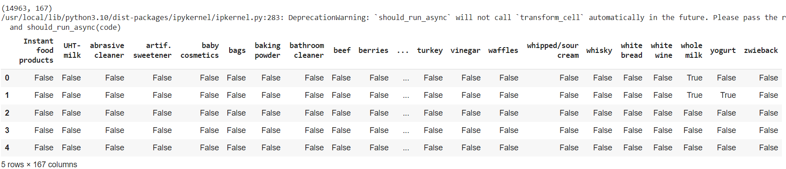

## Modeling
masukan aloritma apriori setelah data preprocessing
``` python
bk_freq_items = apriori(bk_item, min_support=0.01, use_colnames=True, max_len=2)
bk_freq_items.sort_values(by = "support", ascending = False)
```
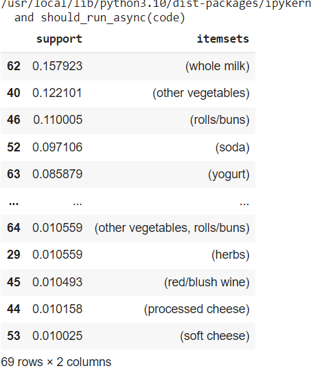

``` python
bk_rules = association_rules(bk_freq_items, metric = "confidence", min_threshold = 0)
bk_rules
```
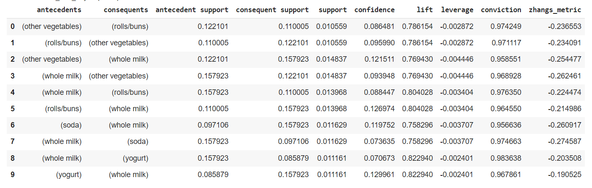

## Visualisasi Hasil Algoritma
``` python
sns.set_context("talk")
sns.relplot(x='antecedent support', y='consequent support', data=bk_rules,
            size='lift', hue='confidence', height=6, aspect=2)
plt.title("Antecedent Support v.s. Consequent Support", fontsize=16, y=1.02)
plt.xlabel('Antecedent Support', fontsize=12)
plt.ylabel('Consequent Support', fontsize=12)
plt.show()
```
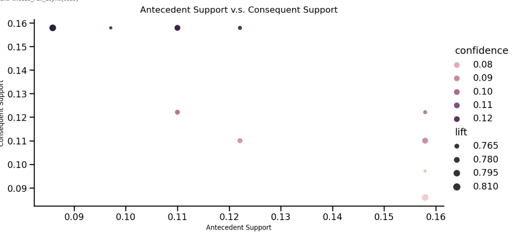

``` python
bk_pivot_suport = bk_rules.pivot(index='antecedents', columns='consequents', values='support')

sns.set_context("talk")
plt.style.use('ggplot')
plt.subplots(figsize=(12, 4))
sns.set()
ax = sns.heatmap(data=bk_pivot_suport, annot=True, fmt='.2f', cmap='YlGnBu', cbar=True)
plt.title("Items' Support Matrix", fontsize=16, y=1.02)
ax.set_xlabel("Consequents",fontsize=16)
ax.set_ylabel("Antecedents",fontsize=16)
plt.xticks(rotation=45)
plt.yticks(rotation=0)
plt.show()
```


